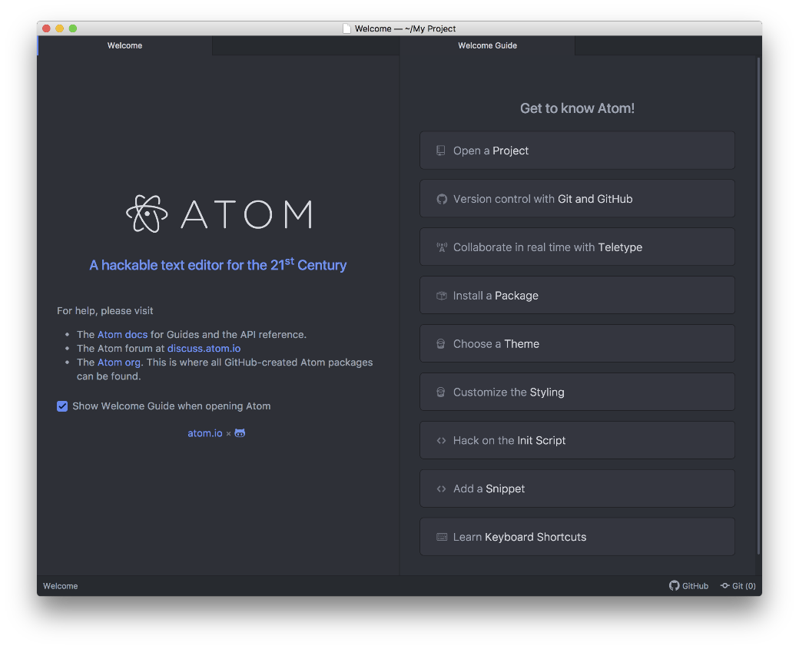
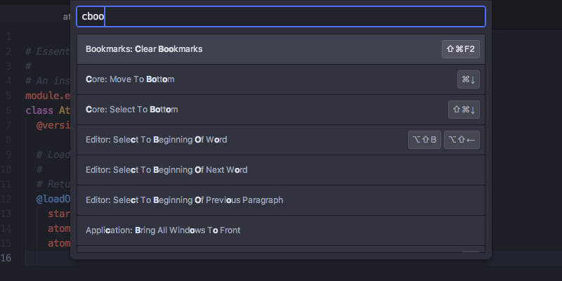
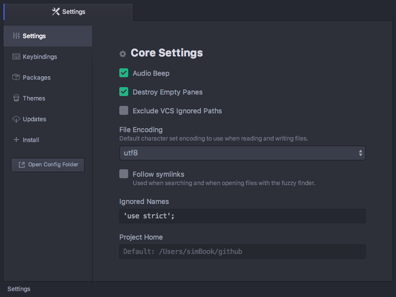
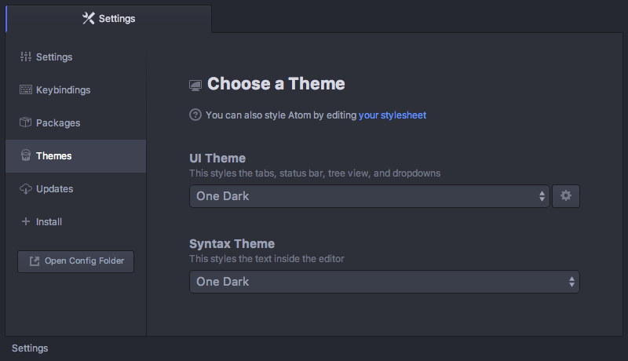
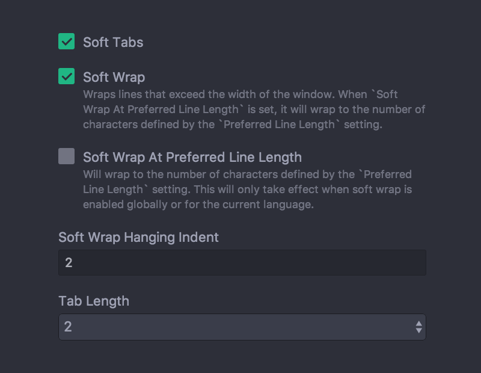
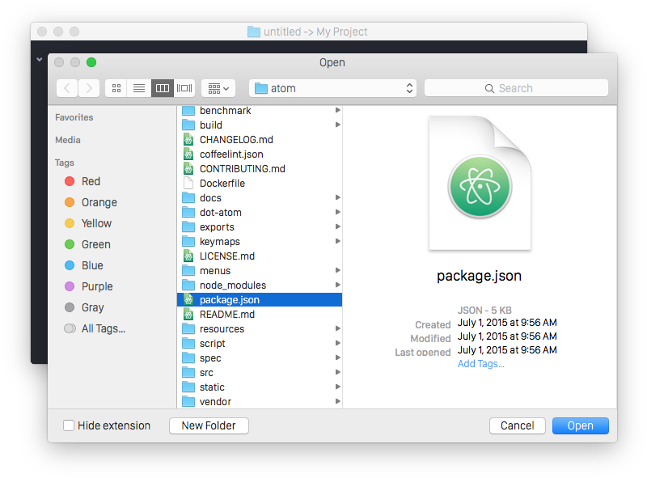
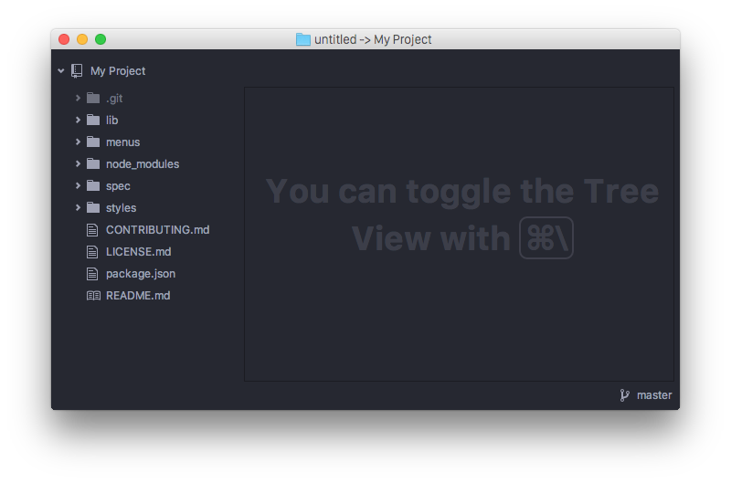
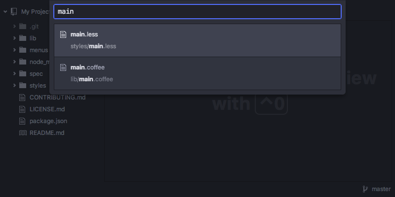

# Atom Basics

Now that Atom is installed on your system, let's fire it up, configure it and get acquainted with the editor.

When you launch Atom for the first time, you should get a screen that looks like this:



This is the Atom welcome screen and gives you a pretty good starting point for how to get started with the editor.

## Terminology

<!-- todo link -->

You can find definitions for all of the various terms that we use throughout the manual in our [Glossary](/resources/sections/glossary/).

## Command Palette

In that welcome screen, we are introduced to probably the most important command in Atom, the Command Palette. If you press <kbd class="platform-mac">Cmd+Shift+P</kbd><kbd class="platform-windows platform-linux">Ctrl+Shift+P</kbd> while focused in an editor pane, the command palette will pop up.

::: tip

Throughout the book, we will use shortcut keybindings like <kbd class="platform-mac">Cmd+Shift+P</kbd><kbd class="platform-windows platform-linux">Ctrl+Shift+P</kbd> to demonstrate how to run a command. These are the default keybindings for the platform that we detected you running.

If you want to see a different platform than the one we detected, you may choose a different one by using the platform selector near the top of the page:


If the Platform Selector is not present, then the current page doesn't have any platform-specific content.

If you have customized your Atom keymap, you can always see the keybinding you have mapped in the Command Palette or the Keybindings tab in the [Settings View](#settings-and-preferences).

:::

This search-driven menu can do just about any major task that is possible in Atom. Instead of clicking around all the application menus to look for something, you can press <kbd class="platform-mac">Cmd+Shift+P</kbd><kbd class="platform-windows platform-linux">Ctrl+Shift+P</kbd> and search for the command.



Not only can you see and quickly search through thousands of possible commands, but you can also see if there is a keybinding associated with it. This is great because it means you can guess your way to doing interesting things while also learning the shortcut key strokes for doing it.

For the rest of the book, we will try to be clear as to the text you can search for in the Command Palette in addition to the keybinding for different commands.

## Settings and Preferences

Atom has a number of settings and preferences you can modify in the Settings View.



<!-- todo link -->

This includes things like changing the theme, specifying how to handle wrapping, font settings, tab size, scroll speed and much more. You can also use this screen to install new packages and themes, which we'll cover in [Atom Packages](/using-atom/sections/atom-packages).

To open the Settings View, you can:

- Use the <span class="platform-mac">*Atom > Preferences*</span><span class="platform-windows">*File > Settings*</span><span class="platform-linux">*Edit > Preferences*</span> menu item in the menu bar
- Search for `settings-view:open` in the [Command Palette](#command-palette)
- Use the <kbd class="platform-mac">Cmd+,</kbd><kbd class="platform-windows platform-linux">Ctrl+,</kbd> keybinding

### Changing the Theme

The Settings View also lets you change the themes for Atom. Atom ships with 4 different UI themes, dark and light variants of the Atom and One theme, as well as 8 different syntax themes. You can modify the active theme by clicking on the Themes tab in the sidebar of the Settings View, or you can install new themes by clicking the Install tab.



The UI themes control the style of UI elements like the tabs and the tree view, while the syntax themes control the syntax highlighting of text you load into the editor. To change the syntax or UI theme, simply pick something different in the appropriate dropdown list.

<!-- todo 2 links -->

There are also dozens of themes on <https://atom.io> that you can choose from if you want something different. We will cover customizing a theme in [Style Tweaks](/using-atom/sections/basic-customization) and creating your own theme in [Creating a Theme](/hacking-atom/sections/creating-a-theme).

### Soft Wrap

You can use the Settings View to specify your whitespace and wrapping preferences.



Enabling "Soft Tabs" will insert spaces instead of actual tab characters when you press the <kbd class="platform-all">Tab</kbd> key and the "Tab Length" setting specifies how many spaces to insert when you do so, or how many spaces are used to represent a tab if "Soft Tabs" is disabled.

The "Soft Wrap" option will wrap lines that are too long to fit in your current window. If soft wrapping is disabled, the lines will simply run off the side of the screen and you will have to scroll the window to see the rest of the content. If "Soft Wrap At Preferred Line Length" is toggled, the lines will wrap at 80 characters instead of the end of the screen. You can also change the default line length to a value other than 80 on this screen.

<!-- todo link -->

In [Basic Customization](/using-atom/sections/basic-customization/) we will see how to set different wrap preferences for different types of files (for example, if you want to wrap Markdown files but not other files).

## Opening, Modifying, and Saving Files

Now that your editor is looking and acting how you want, let's start opening up and editing files. This is a text editor after all, right?

### Opening a File

There are several ways to open a file in Atom. You can do it by choosing *File > Open* from the menu bar or by pressing <kbd class="platform-mac">Cmd+O</kbd><kbd class="platform-windows platform-linux">Ctrl+O</kbd> to choose a file from the standard dialog.



This is useful for opening a file that is not contained in the project you're currently in (more on that next), or if you're starting from a new window for some reason.

<!-- todo 2 links -->

Another way to open a file in Atom is from the command line using the `atom` command. <span class="platform-mac">The Atom menu bar has a command named "Install Shell Commands" which installs the `atom` and `apm` commands [if Atom wasn't able to install them itself](/getting-started/sections/installing-atom/#installing-atom-on-mac).</span><span class="platform-windows platform-linux">The `atom` and `apm` commands are installed automatically as a part of Atom's [installation process](/getting-started/sections/installing-atom/).</span>

You can run the `atom` command with one or more file paths to open up those files in Atom.

```sh
$ atom --help
> Atom Editor v1.8.0

> Usage: atom [options] [path ...]

> One or more paths to files or folders may be specified. If there is an
> existing Atom window that contains all of the given folders, the paths
> will be opened in that window. Otherwise, they will be opened in a new
> window.

> ...
```

This is a great tool if you're used to the terminal or you work from the terminal a lot. Just fire off `atom [files]` and you're ready to start editing.
You can even open a file at a certain line (and optionally column) so the cursor will be positioned exactly where you want. For example, you may search some keyword in a repository to find the line you want to edit:

```sh
$ git grep -n 'Opening a File$'
content/getting-started/sections/atom-basics.md:84:##### Opening a File
```

and then jump to the beginning of that line by appending a colon and the line number to the file path:

```sh
$ atom content/getting-started/sections/atom-basics.md:84
```

Sometimes you may want the cursor to jump to the exact column position of the searched keyword. Just append another colon plus the column number:

```sh
$ git grep -n --column 'Windows Explorer'
content/getting-started/sections/atom-basics.md:150:722
$ atom content/getting-started/sections/atom-basics.md:150:722
```

### Editing and Saving a File

Editing a file is pretty straightforward. You can click around and scroll with your mouse and type to change the content. There is no special editing mode or key commands. If you prefer editors with modes or more complex key commands, you should take a look at the [Atom package list](https://atom.io/packages). There are a lot of packages that emulate popular styles.

To save a file you can choose *File > Save* from the menu bar or <kbd class="platform-mac">Cmd+S</kbd><kbd class="platform-windows platform-linux">Ctrl+S</kbd> to save the file. If you choose *File > Save As* or press <kbd class="platform-mac">Cmd+Shift+S</kbd><kbd class="platform-windows platform-linux">Ctrl+Shift+S</kbd> then you can save the current content in your editor under a different file name. Finally, you can choose *File > Save All* <span class="platform-mac">or press <kbd class="platform-mac">Alt+Cmd+S</kbd></span> to save all the open files in Atom.

## Opening Directories

Atom doesn't just work with single files though; you will most likely spend most of your time working on projects with multiple files. To open a directory, choose the menu item <span class="platform-mac">*File > Open*</span><span class="platform-windows platform-linux">*File > Open Folder*</span> and select a directory from the dialog. You can also add more than one directory to your current Atom window, by choosing *File > Add Project Folder* from the menu bar or pressing <kbd class="platform-mac">Cmd+Shift+O</kbd><kbd class="platform-windows platform-linux">Ctrl+Shift+A</kbd>.

You can open any number of directories from the command line by passing their paths to the `atom` command line tool. For example, you could run the command `atom ./hopes ./dreams` to open both the `hopes` and the `dreams` directories at the same time.

When you open Atom with one or more directories, you will automatically get a Tree View on the side of your window.



The Tree View allows you to explore and modify the file and directory structure of your project. You can open, rename, delete and create new files from this view.

You can also hide and show it with <kbd class="platform-mac">Cmd+\\</kbd><kbd class="platform-windows platform-linux">Ctrl+\\</kbd> or the `tree-view:toggle` command from the Command Palette, and <kbd class="platform-mac">Ctrl+0</kbd><kbd class="platform-windows platform-linux">Alt+\\</kbd> will focus it. When the Tree view has focus you can press <kbd class="platform-all">A</kbd>, <kbd class="platform-all">M</kbd>, or <kbd class="platform-all">Delete</kbd> to add, move or delete files and folders. You can also right-click on a file or folder in the Tree view to see many of the various options, including all of these plus showing the file in <span class="platform-mac">Finder</span><span class="platform-windows">Windows Explorer</span><span class="platform-linux">your native filesystem</span> or copying the file path to the clipboard.

::: tip Atom Packages

Like many parts of Atom, the Tree View is not built directly into the editor, but is its own standalone package that is shipped with Atom by default. Packages that are bundled with Atom are referred to as Core packages. Ones that aren't bundled with Atom are referred to as Community packages.

You can find the source code to the Tree View on GitHub at <https://github.com/atom/tree-view>.

This is one of the interesting things about Atom. Many of its core features are actually just packages implemented the same way you would implement any other functionality. This means that if you don't like the Tree View for example, you could write your own implementation of that functionality and replace it entirely.

:::

### Opening a File in a Project

Once you have a project open in Atom, you can easily find and open any file within that project.

If you press <kbd class="platform-mac">Cmd+T</kbd><kbd class="platform-windows platform-linux">Ctrl+T</kbd> or <kbd class="platform-mac">Cmd+P</kbd><kbd class="platform-windows platform-linux">Ctrl+P</kbd>, the Fuzzy Finder will pop up. This will let you quickly search for any file in your project by typing parts of the path.



You can also search through only the files currently opened (rather than every file in your project) with <kbd class="platform-mac">Cmd+B</kbd><kbd class="platform-windows platform-linux">Ctrl+B</kbd>. This searches through your "buffers" or open files. You can also limit this fuzzy search with <kbd class="platform-mac">Cmd+Shift+B</kbd><kbd class="platform-windows platform-linux">Ctrl+Shift+B</kbd>, which searches only through the files which are new or have been modified since your last Git commit.

<!-- todo link -->

The fuzzy finder uses the `core.ignoredNames`, `fuzzy-finder.ignoredNames` and `core.excludeVCSIgnoredPaths` configuration settings to filter out files and folders that will not be shown. If you have a project with tons of files you don't want it to search through, you can add patterns or paths to either of these config settings or your [standard `.gitignore` files](https://git-scm.com/docs/gitignore). We'll learn more about config settings in [Global Configuration Settings](/using-atom/sections/basic-customization/#global-configuration-settings), but for now you can easily set these in the Settings View under Core Settings.

Both `core.ignoredNames` and `fuzzy-finder.ignoredNames` are interpreted as glob patterns as implemented by the [minimatch Node module](https://github.com/isaacs/minimatch).

::: tip Configuration Setting Notation

Sometimes you'll see us refer to configuration settings all spelled out like "Ignored Names in Core Settings". Other times you'll see us use the shorthand name like `core.ignoredNames`. Both of these refer to the same thing. The shorthand is the package name, then a dot `.`, followed by the "camel-cased" name of the setting.

If you have a phrase you want to camel-case, follow these steps:

1. Lowercase the first word
1. Capitalize the first letter in all other words
1. Remove the spaces

So "Ignored Names" becomes "ignoredNames".

:::
